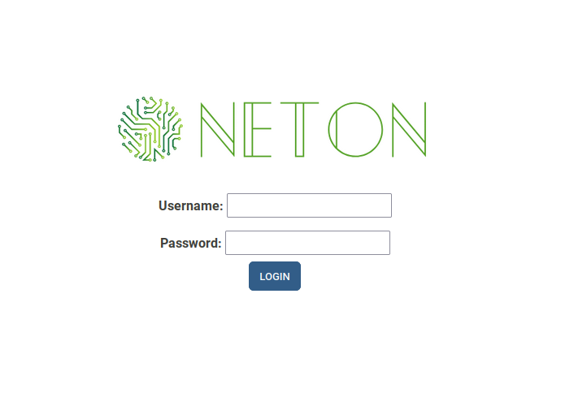
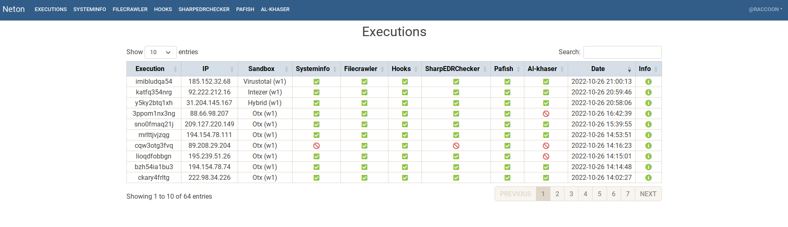
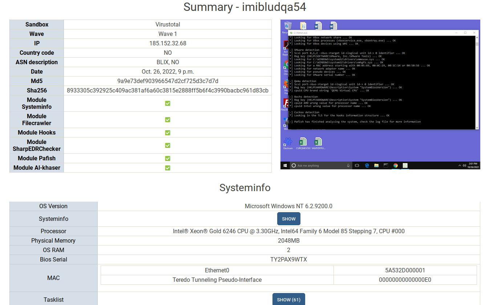
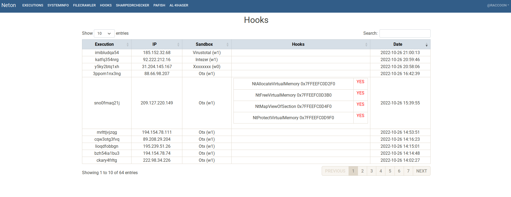
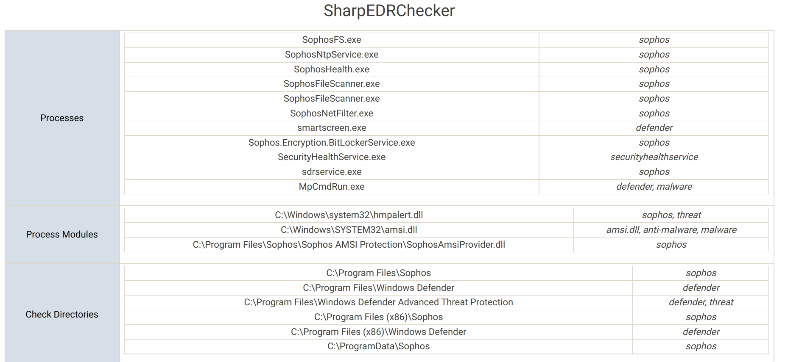
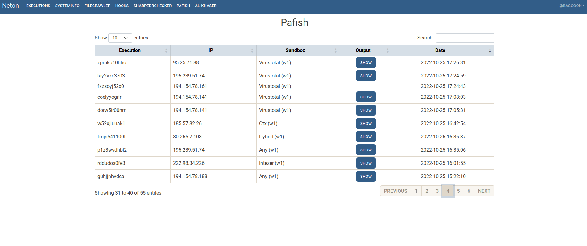
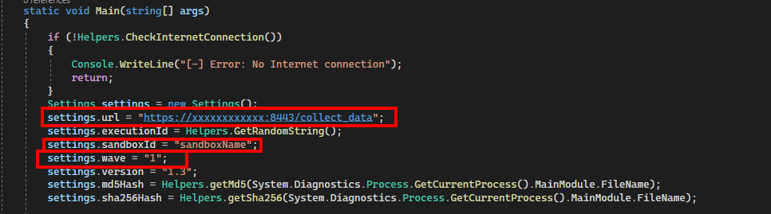

# Neton - A sandbox information gathering framework
  
**Neton** is a tool for **getting information from Internet connected sandboxes**. It is composed by an agent and a web interface that displays the collected information.  
The Neton agent gets information from the systems on which it runs and exfiltrates it via HTTPS to the web server.  

Some of the information it collects:
- Operating system and hardware information
- Find files on mounted drives
- List unsigned microsoft drivers
- Run SharpEDRChecker
- Run Pafish
- Run Al-Khaser
- Detect hooks
- Take screenshots of the desktop

All this information can be used to improve Red Team artifacts or to learn how sandboxes work and improve them.

## Images






## Deployment
### NetonWeb
1. Install (with virtualenv):
```
python3 -m venv venv
source venv/bin/activate
pip3 install -r requirements.txt
```
2. Configure the database:
```
python3 manage.py migrate
python3 manage.py makemigrations core
python3 manage.py migrate core
```
- Create user:
```
python3 manage.py createsuperuser
```
# Launch (test)
```
python3 manage.py runserver
```
# Launch (prod)
- Generate the certificates and store them in the *certs folder*:
```
openssl req -newkey rsa:2048 -new -nodes -x509 -days 3650 -keyout server.key -out server.crt
```
Launch *gunicorn*:
```
./launch_prod.sh
```

# Agent
Build solution with Visual Studio.
The agent configuration can be done from the **Program.cs** class. 
- *url* variable: Url where the information will be exfiltrated (NetonWeb's).
- *sandboxId* variable: Identifier of the sandbox where the samples are uploaded.
- *wave* variable: Way of organising the different times the samples are sent. muestras.


## Extra info
- Slides (ES): https://github.com/Aetsu/Presentaciones/blob/master/Sandbox%20fingerprinting%20-%20Evadiendo%20entornos%20de%20analisis.pdf 
- Video (ES): https://www.youtube.com/watch?v=AyVgIttiUpQ 
- Video (EN): https://www.youtube.com/watch?v=KzwEddl80OQ

## Credits
- **SharpEDRChecker**: [https://github.com/PwnDexter/SharpEDRChecker](https://github.com/PwnDexter/SharpEDRChecker)
- **Pafish**: [https://github.com/a0rtega/pafish](https://github.com/a0rtega/pafish)
- **Al-Khaser**: [https://github.com/LordNoteworthy/al-khaser](https://github.com/LordNoteworthy/al-khaser)
- **OffensiveCSharp -> HookDetector**: [https://github.com/matterpreter/OffensiveCSharp/tree/master/HookDetector](https://github.com/matterpreter/OffensiveCSharp/tree/master/HookDetector)
- **OffensiveCSharp -> DriverQuery**: [https://github.com/matterpreter/OffensiveCSharp/tree/master/DriverQuery](https://github.com/matterpreter/OffensiveCSharp/tree/master/DriverQuery)
